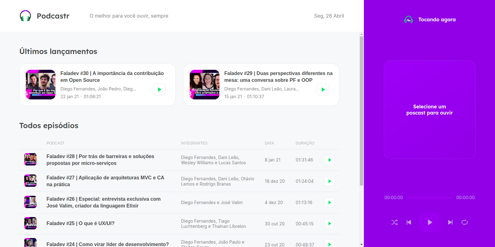
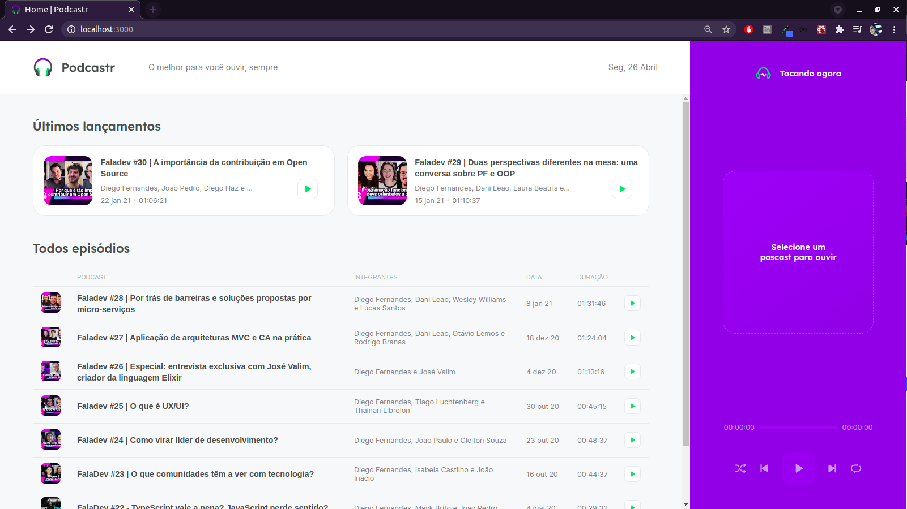
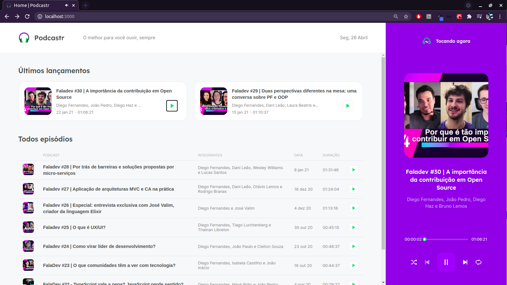
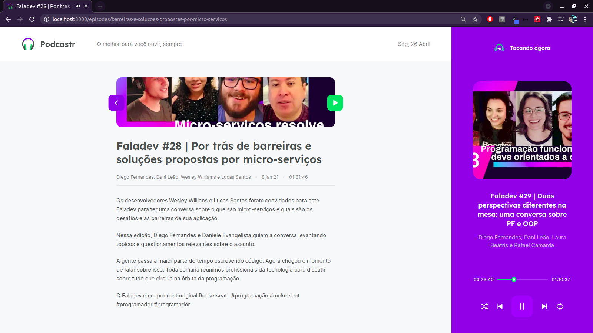

<h1 align="center" >Podcastr 🎧</h1>


<p align="center">
    
</p>

<br/>

<p align="center">
    <a href="#-projeto">Projeto</a>&nbsp;&nbsp;&nbsp;|&nbsp;&nbsp;&nbsp;
    <a href="#-tecnologias">Tecnologias</a>&nbsp;&nbsp;&nbsp;|&nbsp;&nbsp;&nbsp;
    <a href="#-material-de-apoio">Material de apoio</a>&nbsp;&nbsp;&nbsp;|&nbsp;&nbsp;&nbsp;
    <a href="#-apresentação-visual">Apresentação visual</a>&nbsp;&nbsp;&nbsp;|&nbsp;&nbsp;&nbsp;
    <a href="#-como-baixar">Como baixar</a>&nbsp;&nbsp;&nbsp;|&nbsp;&nbsp;&nbsp;
    <a href="#-sobre"> Sobre </a>&nbsp;&nbsp;&nbsp;|&nbsp;&nbsp;&nbsp;
    <a href="#-melhorias">Melhorias</a>

---

## 💬 Projeto

<p align="justify">
    O projeto foi idealizado na trilha de ReactJS da na 5ª edição do NextLevelWeek da Rocketseat. O NLW é um evento online com muito código, desafios, networking e um único objetivo: te levar para o próximo nível.
</p>

---

## 📌 Tecnologias

<p align="justify">
Abaixo estão algumas das tecnologias utilizadas durante o desenvolvimento do projeto. Ainda foi visado: Organizar o diretório da nossa aplicação de forma concisa, limpa e eficiente. Escrever código limpo visando reutilização e eficiência.
</p>
<br>
<p align="center">
  
  
    
  
  
  
  
  

</p>

---

## 🗂 Material de apoio

- [Typescript](https://www.typescriptlang.org/)
- [JsonServer](https://www.npmjs.com/package/json-server)
- [NextJS](https://nextjs.org/)
- [Sass](https://sass-lang.com/)
- [ReactJS](https://pt-br.reactjs.org/)

---

## 📊 Layout:
O layout foi baseado no protótipo idealizado no [Figma](https://www.figma.com/file/UwFEntsHpHYJlHNQAQr4gA/Podcastr?node-id=160%3A2761)
<p align="center">
    
    
    
</p>

---

## ⬇️ Como baixar

```bash
    // Clonar repositório
    $ git clone https://github.com/douglasconstancio/podcastr.git

    // Acessar diretório
    $ cd podcastr

    // Instalar dependências
    $ yarn

    // Iniciar build
    $ yarn build

    // Consumir dados da API de episódios
    $ yarn server

    // Iniciar projeto dev
    $ yarn dev

    // Iniciar projeto modo produção
    $ yarn dev
```
---

## 💭 Melhorias

- Torná-lo responsivo
- Melhorias visuais e de estado de alguns botões
- PWA (Rodar off) - Utilizar e estudar o Next PWA
- Theme dark
- Utilização do Electron e transformar em um app _desktop_

---

## 🚀 Sobre

<p align="justify">
Este projeto foi idealizado na trilha de ReactJS da na 5ª edição do NextLevelWeek da Rocketseat. O NLW é um evento online com muito código, desafios, networking e aprendizado.
</p>

---
